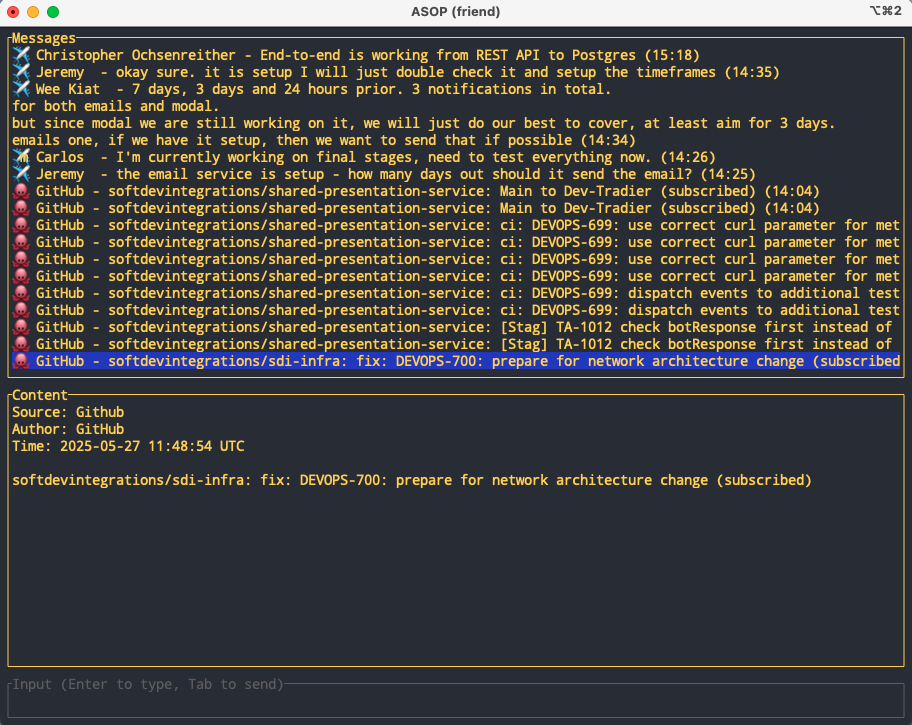

# Friend

A terminal-based message aggregator that displays messages from multiple sources (Discord, Telegram, GitHub, Jira) in a unified feed. Features a two-pane interface with a chronological message list and detailed content view.

## Usage

Run `cargo run` to start the TUI. Use arrow keys or `j`/`k` to navigate messages, and `q` to quit.